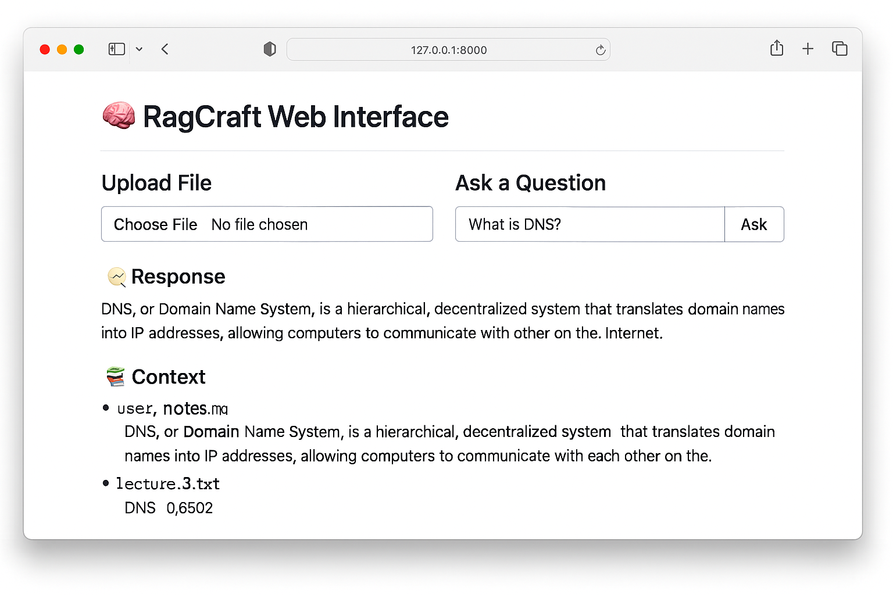

# 🧠 AiLabKit RAG: Ask Questions About Your Documents

[](#cli-usage)

The RAG module is a lightweight tool to turn your documents into an AI-powered knowledge base using Retrieval-Augmented Generation (RAG). It's part of the AiLabKit ecosystem.

---



---

## 🚀 How to Use

### ✅ Install AiLabKit with RAG support

```bash
pip install ailabkit
```

Or with `uv`:

```bash
uv pip install ailabkit
```

---

## CLI Usage

```bash
ailabkit rag index notes/       # Build index from folder or file
ailabkit rag ask "What is TCP?" # Ask a question
ailabkit rag interactive        # Start interactive Q&A mode
ailabkit rag web                # Launch the web interface
```

---

## 📁 Where Indexes Are Stored

- CLI default: `~/.ailabkit/rag_index/default.npz`
- Web UI default: `~/.ailabkit/rag_index/web_index.npz`

You can override using `--output-file` or `--index-path`.

---

## 🧪 Try It With Sample Documents

AiLabKit comes with built-in sample documents to help you get started. You can access these programmatically:

```python
from ailabkit.rag import list_sample_docs, get_sample_docs_path, copy_sample_docs

# List all available sample files
print(list_sample_docs())

# Get the path to the sample directory
samples_path = get_sample_docs_path()
print(f"Sample documents are located at: {samples_path}")

# Copy sample files to a local directory for experimentation
local_path = copy_sample_docs("my_samples")
print(f"Copied sample documents to: {local_path}")
```

Or from the command line:

```bash
# Copy the sample documents to your current directory
python -c "from ailabkit.rag import copy_sample_docs; copy_sample_docs()"

# Create an index from the sample documents
ailabkit rag index sample_docs/

# Ask questions about your samples
ailabkit rag ask "What is in the sample documents?"
```

---

## 📂 Sample Documents

Built-in files include:

- `tcp_protocol.md` – TCP and Networking Concepts in Markdown
- `networking_basics.txt` – Basic Networking Reference in Text
- `tcp_handshake.docx` – TCP Three-Way Handshake in Word Document
- `mobile_game_protocols.pdf` – Multiplayer Game Networking in PDF

Each file demonstrates different document formats and contains networking-related content perfect for testing RAG capabilities.

---

## 🛠️ Makefile/Justfile Shortcuts

```bash
# Using make
make rag-index file=notes.md
make rag-web

# Using just
just rag-index file=notes.md
just rag-web
```

## 🌐 Web Interface

Launch a web interface to ask questions about your documents:

```bash
ailabkit rag web
```

By default, the interface is only accessible from your local machine. To make it accessible from other devices on your network:

```bash
ailabkit rag web --public
```

> ⚠️ When using the `--public` flag, the interface will be accessible to anyone on your network. Use with caution.

You can also specify a custom port (default is 8001):

```bash
ailabkit rag web --port 8888
```

---

## 🧠 Example Workflow

```bash
# Copy sample documents
python -c "from ailabkit.rag import copy_sample_docs; copy_sample_docs('demo')"

# Build index from the documents
ailabkit rag index demo/

# Ask questions
ailabkit rag ask "What is RAG?" --show-context

# Launch the web interface
ailabkit rag web
```

---

## 📚 Programmatic Usage

```python
import os
from pathlib import Path
from ailabkit.rag import (
    load_text_file, 
    chunk_text, 
    get_embeddings, 
    save_index_with_sources,
    get_top_k,
    copy_sample_docs
)

# Copy sample files to a working directory
samples_dir = copy_sample_docs("rag_demo")

# Process a sample file
sample_file = samples_dir / "tcp_protocol.md"
text = load_text_file(sample_file)

# Chunk the text
chunks = chunk_text(text, chunk_size=50)

# Track the source of each chunk
sources = [f"{sample_file.name}:{i}" for i in range(len(chunks))]

# Get embeddings
vectors = get_embeddings(chunks)

# Save the index
index_path = Path("sample_index.npz")
save_index_with_sources(vectors, chunks, sources, index_path)

# Query the index
query = "What is RAG?"
results = get_top_k(query, index_path, k=2)

print("Query:", query)
print("\nResults:")
for chunk, source in results:
    print(f"\nSource: {source}")
    print(f"Content: {chunk[:100]}...")
```

---

## 📚 Related Docs

- [RAG Flow Diagram](rag-flow.md) - Visual overview of how RAG works
- [RAG LLM Explanation](rag-llm-explain.md) - Technical details of RAG implementation
- [Chat Module Guide](chat-guide.md) - Learn about the chat module
- [Agent Module Guide](agent-guide.md) - Learn about the agent module
- [Ollama Setup Guide](ollama-guide.md) - Set up local models with Ollama
- [Mini Projects](projects/index.md) - Example projects using AiLabKit

---

Designed for educators. Built for learners. Powered by open models.